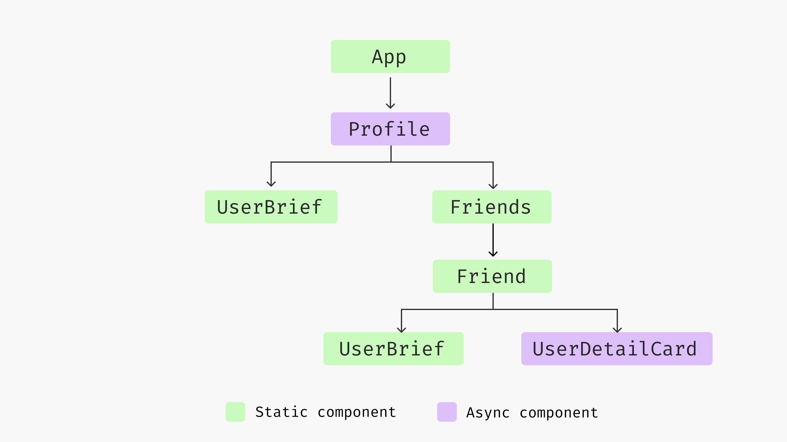
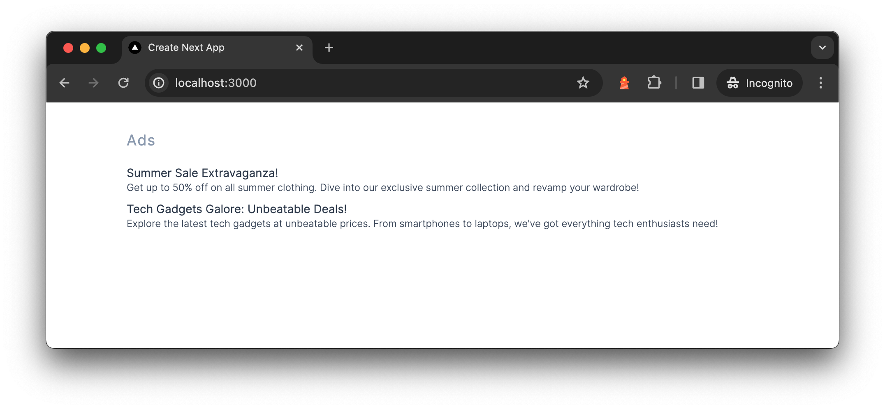

# Data fetching patterns in React application

Today, most applications can send hundreds of requests for a single page. For example, my Twitter home page sends around 300 requests, and an Amazon product details page sends around 600 requests. Some of them are for static assets (JavaScript, CSS, font files, icons, etc.), but there are still around 100 requests for async data fetching - either for timelines, friends, or product recommendations, as well as analytics events. That’s quite a lot.

Data fetching is a critical part of any web application, not only because the nature of async programming can be tricky and not reliable 100%, but also there are too many not-obvious cases to consider under the hood. In this article, I would like to discuss a few common problems and patterns you should consider when it comes to getting data from the server side.

I would like to discuss the traditional code splitting techniques, as well as parallel requests when possible by restructuring your component hierarchy, and then talk about Static Site Generation and the new Server-Side Rendering (with React Server Component), and how to use these techniques together to achieve a better user experience.

I think the best way to talk about these concepts is through a concrete example, but I also don't want to make it too tedious and complicated just to set up the context. So I’ll start with something simple and make it slightly more realistic gradually. Also, I don’t want to bore you with too many code snippets, especially for the styling part (I’m using tailwindcss for the UI, and if you have used it before, you know how long the code snippet could be in a React component. If you want to see the whole details, I have hosted them in this repo, and this one for the server side rendering)

Alright, let’s dive into the example we’re going to use throughout the article, a `Profile` page.

## Introducing the application

Let’s say we’re building a single-page application; we’ll be working on the Profile screen of the application. To begin with, on `Profile` we’ll show the user’s brief (including name, avatar, and a short description), and then we also want to show their connections (similar to followers on Twitter or LinkedIn connections).


The data are from two separate API calls, the user brief API `/users/<id>` returns user information for a given user id, which is a simple object described as follows:

```json
{
  "id": "u1",
  "name": "Juntao Qiu",
  "bio": "Developer, Educator, Author",
  "interests": [
    "Technology",
    "Outdoors",
    "Travel"
  ]
}
```

The friend API `/users/<id>/friends` endpoint returns a list of friends for a given user, each list item in the response is the same as the above user data. The reason we have two endpoints instead of returning a `friends` section of the user API is that there are cases where one could have too many friends (say 1,000), which will make it less flexible to paginate (as well as we want the response to be small) compared to the separate endpoints.

## Implement the Profile component

Now let’s create the `Profile` component, make a request, and render the result. The *standard* way of doing it in React is:

```jsx
const Profile = ({ id }: { id: string }) => {
  const [loading, setLoading] = useState<boolean>(false);
  const [error, setError] = useState<Error | undefined>();
  const [user, setUser] = useState<User | undefined>();

  useEffect(() => {
    const fetchUser = async () => {
      try {
        setLoading(true);
        const data = await get<User>(`/users/${id}`);
        setUser(data);
      } catch (e) {
        setError(e as Error);
      } finally {
        setLoading(false);
      }
    };

    fetchUser();
  }, [id]);

  if (loading || !user) {
    return <div>Loading...</div>;
  }

  return (
    <>
      {user && <UserBrief user={user} />}
    </>
  );
};
```

For the `Profile` component, we initiate states for loading, errors, and user data. Using `useEffect`, we fetch user data based on `id`, toggling loading status and handling errors accordingly. Upon successful data retrieval, we update the user state, else display a loading indicator.

The `get` function simplifies fetching data from a specific endpoint by appending the endpoint to a predefined base URL. It checks the response's success status and either returns the parsed JSON data or throws an error for unsuccessful requests, streamlining error handling and data retrieval in our application.

```jsx
const baseurl = "https://icodeit.com.au/api/v2";

async function get<T>(url: string): Promise<T> {
  const response = await fetch(`${baseurl}${url}`);

  if (!response.ok) {
    throw new Error("Network response was not ok");
  }

  return await response.json() as Promise<T>;
}
```

React will try to render the component initially, but as the data `user` isn’t available, it returns "loading..." in a `div`. Then the `useEffect` is invoked, and the request is kicked off. Once at some point, the response returns, React re-renders the `Profile` component with `user` fulfilled, so you can now see the user section with name, avatar, and title.

If we visualize the timeline of the above code, you will see the following sequence. The browser firstly downloads the HTML page, and then when it encounters script tags and style tags, it might stop and download these files, and then parse them to form the final page. Note that this is a relatively complicated process, and I’m oversimplifying here, but the basic idea of the sequence is correct.

So React can start to render only when the JS are parsed and executed, and then it finds the `useEffect` for data fetching; it has to wait until the data is available for a re-render.


Now in the browser, we can see a "loading..." when the application starts and then the user brief section when data is loaded.


## Implement the Friends list

Now let’s have a look at the second section of the Profile - the friend list. We can create a separate component `Friends` and fetch data in it; the logic is pretty similar to what we see above in the `Profile` component.

And then in the Profile component, we can use Friends as a regular component:

```tsx
const Friends = ({ id }: { id: string }) => {
  const [loading, setLoading] = useState<boolean>(false);
  const [error, setError] = useState<Error | undefined>(undefined);

  const [users, setUsers] = useState<User[]>([]);

  useEffect(() => {
    const fetchFriends = async () => {
      try {
        setLoading(true);
        const data = await get<User[]>(`/users/${id}/friends`);
        setUsers(data);
      } catch (e) {
        setError(e as Error);
      } finally {
        setLoading(false);
      }
    };

    fetchFriends();
  }, [id]);
  
  // loading & error handling...

  return (
    <div>
      <h2>Friends</h2>
      <div>
        {users.map((user) => (
        // render user list
        ))}
      </div>
    </div>
  );
};
```

And then in the Profile component, we can use Friends as a regular component:

```jsx
const Profile = ({ id }: { id: string }) => {
	//...
	
  return (
    <>
      {user && <UserBrief user={user} />}
      <Friends id={id} />
    </>
  );
};
```

The code works fine, and it looks pretty clean and readable, `UserBrief` renders a `user` object passed in, while `Friends` manage its own data fetching and rendering logic altogether. If we visualize the component tree, it would be something like this:


Both the `Profile` and `Friends` have logic for data fetching, loading checks, and error handling. Since there are two separate data fetching calls, and if we look at the request timeline, we will notice something interesting.


The `Friends` will not start data fetching until the user state is fulfilled, which is quite a waste. Especially when you consider that React render takes only a few milliseconds while data fetching normally takes seconds - that means most of the time of a Friends component is waiting. This is a well-known issue called Request Waterfall, and it’s quite common when building a React application with multiple data fetching.

## Request Waterfall

Imagine when we build a larger application that a component that requires data can be deeply nested in the component tree, to make the matter worse these components are developed by different teams, it’s hard to see whom we’re blocking.


Luckily such cases can be eliminated simply by parallelizing requests at the upper level in the tree. For example, we could send both requests in `Profile`, and convert `Friends` into a static component that responds only to whatever is passed in.

## Sending Parallel requests

We could use the **Promise** API `Promise.all` to send both requests for the user’s basic information and their friends list.

```jsx
const Profile = ({ id }: { id: string }) => {
  //...

  useEffect(() => {
    const fetchUserAndFriends = async () => {
      try {
        setLoading(true);
        const [user, friends] = await Promise.all([
          get<User>(`/users/${id}`),
          get<User[]>(`/users/${id}/friends`),
        ]);
        setUser(user);
        setFriends(friends);
      } catch (e) {
        setError(e as Error);
      } finally {
        setLoading(false);
      }
    };

    fetchUserAndFriends();
  }, [id]);

  //...
};
```

Within this `useEffect`, we simultaneously fetch user details and their friends using `Promise.all`, improving efficiency by parallelizing the network requests. Upon success, we update the respective states; on failure, we capture and set any errors encountered. This approach minimizes waiting time, ensuring both datasets are ready for rendering as soon as possible.

And the component structure, if visualized, would be like the following illustration


And the timeline is much shorter than the previous one as we send two requests in parallel. The `Friends` component can render in a few milliseconds as when it starts to render, the data is already ready and passed in.


Note that the longest wait time depends on the slowest network request, which is much faster than the sequential ones. And if we could send as many of these independent requests at the same time at an upper level of the component tree, a better user experience can be expected.

There are cases while you cannot parallel requests, for example, we will make a recommendation feeds list on the `Profile` page, and this recommendation needs users’ interests. We can only send a request for fetching the recommendation when we have the response of the user brief API.

We cannot simply do parallel requests for such cases, but we’ll address that issue in the later section. But for now, let’s look into an enhancement of the `Friend` list component.

## Introducing UserDetailCard comopnent

Let’s say we need a feature that when users hover on top of a `Friend`, we show a popup so they can see more details about that user.


When the popup shows up, we need to send another service call to get the user details (like their homepage and number of connections, etc.). We will need to update the `Friend` component to something like the following.

```jsx
import { Popover, PopoverContent, PopoverTrigger } from "@nextui-org/react";
import { UserBrief } from "./user.tsx";

import UserDetailCard from "./user-detail-card.tsx";

export const Friend = ({ user }: { user: User }) => {
  return (
    <Popover placement="bottom" showArrow offset={10}>
      <PopoverTrigger>
        <button>
          <UserBrief user={user} />
        </button>
      </PopoverTrigger>
      <PopoverContent>
        <UserDetailCard id={user.id} />
      </PopoverContent>
    </Popover>
  );
};
```

The `UserDetailCard`, is pretty similar to the `Profile` component, it sends a request to load data and then renders the result once it gets the response.

```jsx
export function UserDetailCard({ id }: { id: string }) {
  const [loading, setLoading] = useState<boolean>(false);
  const [detail, setDetail] = useState<UserDetail | undefined>();

  useEffect(() => {
    const fetchUserDetail = async () => {
      setLoading(true);
      const data = await get<UserDetail>(`/users/${id}/details`);

      setLoading(false);
      setDetail(data);
    };

    fetchUserDetail();
  }, [id]);

  if (loading || !detail) {
    return <div>Loading...</div>;
  }

  return (
    <div>
    {/* render the user detail*/}
    </div>
  );
}
```

We’re using `Popover` and the supporting components from `nextui`, which provides a lot of beautiful and out-of-box components for building modern UI. The only problem here, however, is that the package itself is relatively big, also not everyone uses the feature (hover and show details), so loading that extra large package for everyone isn’t ideal - it would be better to load the `UserDetailCard` on demand - whenever it’s required.



We can achieve this by using code split. We can delay the big (or complicated module) into a separate file, and only load them when the user has triggered some interaction - or in the later stage that not block the critical path of an application.

## Code splitting

It’s easy to achieve within React’s lazy and suspense API. So instead of static import, we use `React.lazy` to wrap the import statement, and wrap the `UserDetailCard` with a `Suspense`. When React encounters the suspense boundary, it shows a `fallback` first, and when the dynamic file is loaded, it tries to render it.

```jsx
import { Popover, PopoverContent, PopoverTrigger } from "@nextui-org/react";
import { UserBrief } from "./user.tsx";

const UserDetailCard = React.lazy(() => import("./user-detail-card.tsx"));

export const Friend = ({ user }: { user: User }) => {
  return (
    <Popover placement="bottom" showArrow offset={10}>
      <PopoverTrigger>
        <button>
          <UserBrief user={user} />
        </button>
      </PopoverTrigger>
      <PopoverContent>
        <Suspense fallback={<div>Loading...</div>}>
          <UserDetailCard id={user.id} />
        </Suspense>
      </PopoverContent>
    </Popover>
  );
};
```

This snippet defines a `Friend` component displaying user details within a popover from Next UI, which appears upon interaction. It leverages `React.lazy` for code-splitting, loading the `UserDetailCard` component only when needed. This lazy-loading, combined with `Suspense`, enhances performance by splitting the bundle and showing a fallback during the load.

If we visualize the above code, it renders in the following sequence.


Note that when the user hovers and we download the JavaScript bundle, there will be some extra time for the browser to parse the JavaScript. Once that part of the work is done, we can get the user details by calling `/users/<id>/details` API. Eventually, we can use that data to render the content of the popup `UserDetailCard`.

## Preload data before the lazy load

However, as you might have already seen the similarity here, we could request the JavaScript bundle and the network request parallely. Meaning, whenever a `Friend` component is hovered, we can trigger a network request and cache the result, so that by the time when the bundle returns, we can use the data to render the component immediately.

For example, we can use `preload` from the `swr` package, and then register an `onMouseEnter` event to the trigger component of `Popover`,

```jsx
import { preload } from "swr";
import { getUserDetail } from "../api.ts";

const UserDetailCard = React.lazy(() => import("./user-detail-card.tsx"));

export const Friend = ({ user }: { user: User }) => {
  const handleMouseEnter = () => {
    preload(`/user/${user.id}/details`, () => getUserDetail(user.id));
  };

  return (
    <Popover placement="bottom" showArrow offset={10}>
      <PopoverTrigger>
        <button onMouseEnter={handleMouseEnter}>
          <UserBrief user={user} />
        </button>
      </PopoverTrigger>
      <PopoverContent>
        <Suspense fallback={<div>Loading...</div>}>
          <UserDetailCard id={user.id} />
        </Suspense>
      </PopoverContent>
    </Popover>
  );
};
```

That way, the popup itself can have much less time to render, which brings a better user experience.


So when a user hovers on a `Friend`, we download the corresponding JavaScript bundle as well as download the data needed to render the user detail, and by the time `UserDetailCard` renders, it sees the existing data and renders immediately.


The data fetching and loading is shifted to `Friend`, and for `UserDetailCard`, it reads from the local cache maintained by `swr`.

```jsx
import useSWR from "swr";

export function UserDetailCard({ id }: { id: string }) {
  const { data: detail, isLoading: loading } = useSWR(
    `/user/${id}/details`,
    () => getUserDetail(id)
  );

  if (loading || !detail) {
    return <div>Loading...</div>;
  }
  
  return (
    <div>
    {/* render the user detail*/}
    </div>
  );
}
```

This component uses the `useSWR` hook for data fetching, making the `UserDetailCard` dynamically load user details based on the given `id`. `useSWR` offers efficient data fetching with caching, revalidation, and automatic error handling. The component displays a loading state until the data is fetched. Once the data is available, it proceeds to render the user details.

I would like to recap a bit before we move to the second half of the article. We have discussed two common issues in data fetching: parallel request and lazy loading.

Ideally, you should level up the request to an upper level and send them in parallel when you can, even though in some cases it might not be feasible to do so. For example, if you’re working on a higher-level component and doesn’t have knowledge about the children components (could be other teams working on them).

And for lazy load, try to split these non-critical rendering or data fetching into a separate bundle, so they can be loaded dynamically based on user interaction, e.g., a button click or hover. And you can use preload to make the JavaScript downloading and data fetching parallel.

You might also be aware that all of the techniques we discussed are based on one assumption - the backend returns data and the frontend uses these data. But if we step back a bit and consider this: do we really need to divide the frontend and backend clearly, extensively? Can we in any way, allow the backend to return more data so we don’t have to fetch them in the first place?

## Server-side rendering

Like most typical React applications nowadays, the application we’re building so far are purely rendered on client side. However, such application has a significant drawback on SEO, as when the search engine robot crawls our application URL, it won’t be able to get the full content but a meaningless `<div id="root"></div>`.

```jsx
import React from 'react'
import { renderToString } from 'react-dom/server'

import App from './App';

const html = renderToString(<App/>);

console.log(html);
```

You can think of the above application as a normal Node script that can be executed in the backend service.

```jsx
node build/out.js
```

would output the following content:

```jsx
<div><div><h1>Juntao Qiu</h1><p>Developer, Educator, Author</p></div></div>
```

You can then place such content into the `<div id="root"></div>`, and then in the frontend, React can hydrate the application with user interactions. It can save the first round of render - which can be a great time saver when the application is big.


In theory, the mechanism works perfectly, and both the backend and frontend are working seamlessly. However, if the output is too long, `renderToString` might not be a good option as it needs all the components to be rendered.

Moreover, traditional SSR lacks support for data fetching, implying that the `useEffect` patterns used on the client side are ineffective. This necessitates handling data fetching at the backend. React Server Components offer a solution to this issue, providing a way to enhance asynchronous programming practices across React codebases.

## Introducing React Server Component

React Server Components allow rendering components on the server, reducing client-side bundle size and improving performance by fetching data and executing logic server-side. They seamlessly integrate with client components for an optimized, interactive user experience.

```tsx
async function getFriends(id: string) {
  return await get<User[]>(`/users/${id}/friends`);
}

async function Friends({ id }: { id: string }) {
  const friends = await getFriends(id);

  return (
    <div>
      <h2>Friends</h2>
      <div>
        {friends.map((user) => (
          <Friend user={user} key={user.id} />
        ))}
      </div>
    </div>
  );
}
```

This React Server Component, `Friends`, showcases direct server-side data fetching with an `async` function to retrieve a user's friends, differentiating it from traditional client components. Unlike client components that initiate data fetching effects (`useEffect`) and manage loading states within the browser, server components fetch data during server-side rendering. The `getFriends` call executes on the server, with the resulting friends list rendered into HTML before reaching the client. This server-side execution enables a more efficient initial render without JavaScript overhead, enhancing performance and reducing bandwidth usage.

And we could use the Suspense boundary with the React Server Component defined above in the following:

```tsx
<Suspense fallback={<FriendsSkeleton />}>
  <Friends id={id} />
</Suspense>
```

When `Friends` is rendered inside a `<Suspense>` boundary, React knows to wait for the `Friends` component's asynchronous data fetching to complete before rendering it. During this wait time, React displays the `<Suspense>` component's `fallback` content, in this case, `<FriendsSkeleton />`, providing a smooth user experience by showing a placeholder or loading indicator.

### The new suspense model

Originally, Suspense was primarily used for code-splitting and lazy loading components. However, its scope has been broadened to include data fetching and other asynchronous operations, marking a significant evolution from its initial introduction.

This broader use of Suspense allows developers to more effectively manage asynchronous dependencies within their components, improving the handling of loading states, error states, and the orchestration of concurrent tasks. It can significantly improve code clarity. Without these noise, it allows you to focus on **what the component is doing - not how to do it**.

Think of the `Friends` component above in the first section. It has to maintain three different states and register the callback in `useEffect`, setting the flag correctly at the right time, which is pretty annoying:

```jsx
const Friends = ({ id }: { id: string }) => {
  //...

  useEffect(() => {
    const fetchFriends = async () => {
      try {
        setLoading(true);
        const data = await get<User[]>(`/users/${id}/friends`);
        setUsers(data);
      } catch (e) {
        setError(e as Error);
      } finally {
        setLoading(false);
      }
    };

    fetchFriends();
  }, [id]);
  
  // loading & error handling...
};
```

While with the new suspense and React Server Component, the language you use is much simpler, and in the `Friends` you describe what you want to get and then render:

```jsx
async function Friends({ id }: { id: string }) {
  const friends = await getFriends(id);

  return (
    <div>
      <h2>Friends</h2>
      <div>
        {friends.map((user) => (
          <Friend user={user} key={user.id} />
        ))}
      </div>
    </div>
  );
}
```

And declaratively when you use the `Friends`, you use an Error boundary and Suspense Boundary:

```jsx
<ErrorBoundary fallback={<Error />}>
	<Suspense fallback={<FriendsSkeleton />}>
	  <Friends id={id} />
	</Suspense>
</ErrorBoundary>
```

The `ErrorBoundary` catches any rendering errors in its child components and displays the specified fallback UI, in this case, `<Error />`. Nested within it, `Suspense` manages the asynchronous loading of the `Friends` component, showing a `<FriendsSkeleton />` placeholder until the component's data dependencies are resolved. This setup ensures that the user interface remains responsive and informative during data fetching and in the event of any errors, improving the overall user experience by seamlessly integrating error handling and loading state management.

## Streaming Server-Side Rendering

From React 18 onwards, several streaming rendering APIs have been introduced. Similar to how we handle I/O operations, we don't need to load everything into memory at once. Instead, we process the data in smaller chunks and in a streaming manner. With streaming, we can immediately render what's available to the user without waiting for all content to be ready.

Additionally, the new Suspense boundary makes server-side rendering (SSR) more powerful than before. For example, let's define a React Server Component as follows:

```jsx
export async function Profile({ id }: { id: string }) {
  return (
    <div>
      <h1>Profile</h1>
      <div>
        <div>
          <Suspense fallback={<UserBriefSkeleton />}>
            <UserBrief id={id} />
          </Suspense>
        </div>
        <div>
          <Suspense fallback={<FriendsSkeleton />}>
            <Friends id={id} />
          </Suspense>
        </div>
      </div>
    </div>
  );
}
```

With streaming SSR (Server-Side Rendering), the `Profile` component leverages React's asynchronous and concurrent capabilities to enhance performance and user experience. When rendered on the server, this component initiates the streaming of HTML to the client as soon as possible, even before all data dependencies are resolved.

We could break it down into a few steps:

Initially, SSR might return the following HTML structure:

```html
<div>
  <h1>Profile</h1>
  <div>
    <div>
      <p>Loading user...</p>
    </div>
    <div>
      <p>Loading friends...</p>
    </div>
  </div>
</div>
```

And then, as the user data becomes available:

```html
<div>
  <h1>Profile</h1>
  <div>
    <div>
      <div><div><h1>Juntao Qiu</h1><p>Developer, Educator, Author</p></div></div>
    </div>
    <div>
      <p>Loading friends...</p>
    </div>
  </div>
</div>
```

From the end user's perspective, the application not only appears to be working, but it actually is interactive—you can engage with the loaded parts as soon as they're ready, while the rest of the content continues to load.


Finally, I'd like to discuss Static Site Generation (SSG), which is equally important. In many cases, when we know what data to fetch before the user makes a request, we can make your web application extremely fast and responsive.

## Static Site Generation

Static Site Generation (SSG) is a methodology in web development where web pages are pre-rendered to static HTML files during a build process before deployment. Unlike dynamic sites that generate content on the fly with each request, SSG prepares all pages in advance. This approach means that a server simply serves pre-built HTML, CSS, and JavaScript files to the browser without the need to execute server-side code or database queries at runtime.

The advantages of SSG include faster load times, since static files can be quickly served from a CDN; improved security, as there is no direct database or server-side application interaction; and better SEO, due to the availability of content as soon as the page loads. 

SSG is particularly popular for blogs, documentation sites, and marketing websites, where content does not change frequently. Next.js, for instance, has built-in functionality to render content as static by default. This means you can generate content at build time. Note that you can still access data through APIs or databases; it's just that the content it generates is static.

For instance, if we want to generate some advertisements everytime when the website is built, we can define a React Server Component like the following:

```jsx
async function getAds(): Promise<Ad[]> {
  return await get("/ads");
}

export async function Ads() {
  const ads = await getAds();

  return (
    <div>
      <h2>Ads</h2>
      <div>
        {ads.map((ad) => (
          <div key={ad.id}>
            <h3>{ad.title}</h3>
            <p>{ad.content}</p>
          </div>
        ))}
      </div>
    </div>
  );
}
```

The `Ads` component shows a pattern where data fetching occurs at build time rather than runtime. When the site is being built, `getAds` is called to fetch advertisements from the `/ads` endpoint. This async function retrieves an array of ads, and this data becomes immediately available as part of the component's build process. 



The component then renders HTML for each advertisement, including the ad's title and content. Since the ads are fetched during the build process, the rendered page with all its advertisements is served as static HTML to the user. This means there's no need for the client's browser to run JavaScript to fetch the ads after the page loads, leading to faster page rendering and an improved user experience. 

If we visualize the timeline, you can clearly see that the effort to render the full version of the page is pre-made. Thus, there's no need to fetch data dynamically through side effects.


We've covered a wide range of patterns and how they apply to various challenges. I realize there's quite a bit to take in, from code examples to diagrams. If you're looking for a more guided approach, I've put together [a comprehensive tutorial](https://www.icodeit.com.au/tutorials/advanced-network-patterns-react) on my website. It offers a more interactive exploration of these concepts, so don't hesitate to check it out for a deeper dive into the subject.

## Conclusion

Data fetching is a complex task, but understanding and applying the right strategies can significantly improve our applications. In summarizing our exploration of data fetching and content rendering strategies in React applications, here are the key takeaways:

- **Parallel Requests**: Whenever possible, fetch data in parallel to minimize waiting times and improve application responsiveness.
- **Lazy Loading and Suspense**: Use lazy loading for components that are not critical to the initial rendering path, utilizing Suspense to manage loading states and code splitting, keeping your application lightweight and fast.
- **Preloading Data**: Anticipate user interactions and preload data accordingly, ensuring a seamless and responsive user experience.
- **New Suspense Model**: The enhanced Suspense model in React facilitates more declarative coding for asynchronous data fetching, making your code cleaner and more intuitive.
- **Server-Side Rendering (SSR)**: SSR, particularly with React Server Components and the new Suspense, offers a powerful way to improve performance and SEO, providing content to the user faster and more efficiently.
- **Static Site Generation (SSG)**: For content that doesn't change often, SSG is a valuable technique that complements dynamic rendering, enabling faster page loads and optimized resource usage.
- **Streaming**: Streaming techniques can further enhance user experience by delivering content in chunks as it becomes available, although its implementation may depend on specific backend technologies like Next.js.

By thoughtfully applying these techniques, developers can build React applications that are not only performant and scalable but also provide a delightful user experience through efficient data fetching and content rendering strategies.
