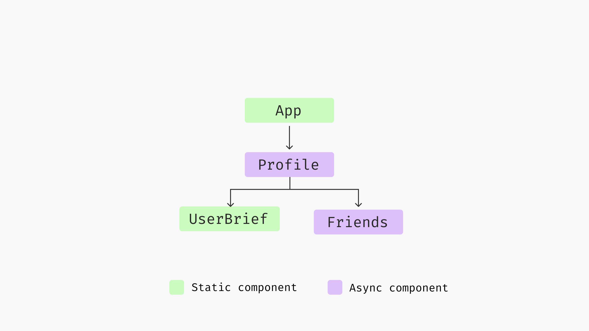

# Data fetching patterns in React application

Today, most of the applications can send hundreds of requests for a single page. For example, my twitter home page send around 300 requests, and Amazon product details page sends around 600 requests. Some of them are for static assets (JavaScript, CSS, font files,icons, etc.),  there are still around 100 requests for async data fetching - either for timelines, friends or product recommendations, as well as analytics events. That’s quite a lot.

Data fetching is a critical part of any web application, not only because the nature of the async programming can be tricky and not reliable 100%, but also there are too many not-obvious-cases to consider of under the hood. In this article, I would like to discuss a few common problems and patterns you should consider when it comes to get data from the server side.

I would like to discuss the traditional code splitting techniques, as well as parallel requests when possible by restructuring your component hierarchy, and then talk about Static Site Generation and the new Server-Side Rendering (with React Server Component), and how to use these techniques together to achieve a better user experience.

I think the best way to talk about these concepts is through a concrete example, but I also don't want to make it too tedious and complicated to just set up the context. So I’ll start with something simple and make it slightly more realistic gradually. Also I don’t want to bore you with too many code snippets, especially for the styling part (I’m using tailwindcss for the UI, and if you have used it before, you know how long the code snippet could be in a React component. If you want to see the whole details, I have hosted them in this repo, and this one for the server side rendering) 

Alright, let’s dive into the example we’re going to use through the article, a `Profile` page.

## Profile page

Let’s say we’re building a single-page application, we’ll be working on the Profile screen of the application. To begin with, on `Profile` we’ll show the user’s brief (including name, avatar and a short description), and then we also want to show their connections (similar to followers on Twitter or LinkedIn connections). 


The data are from two separate API calls, the user brief API `/users/<id>` returns user information for a given user id, which is a simple object described as follows:

```json
{
  "id": "u1",
  "name": "Juntao Qiu",
  "bio": "Developer, Educator, Author",
  "interests": [
    "Technology",
    "Outdoors",
    "Travel"
  ]
}
```

The friend API  `/users/<id>/friends` endpoint returns a list of friends of a given user, each list item in the response is the same as the above user data. The reason we have two endpoints instead of returning a `friends` section of the user API is that there are cases where one could have too many friends (say 1,000), which will make it less flexible to paginate (as well as we want the response to be small) compared to the separate endpoints.

## Implement the Profile component

Now let’s create the `Profile` component, make a request and render the result. The *standard* way of doing it in React is:

```jsx
const Profile = ({ id }: { id: string }) => {
  const [loading, setLoading] = useState<boolean>(false);
  const [error, setError] = useState<Error | undefined>();
  const [user, setUser] = useState<User | undefined>();

  useEffect(() => {
    const fetchUser = async () => {
      try {
        setLoading(true);
        const data = await get<User>(`/users/${id}`);
        setUser(data);
      } catch (e) {
        setError(e as Error);
      } finally {
        setLoading(false);
      }
    };

    fetchUser();
  }, [id]);

  if (loading || !user) {
    return <div>Loading...</div>;
  }

  return (
    <>
      {user && <UserBrief user={user} />}
    </>
  );
};
```

**explain the code a bit**

The `get` function is simply a wrapper of the native `fetch` API, it throws an error when `response.ok` isn’t presenting:

```jsx
const baseurl = "https://icodeit.com.au/api/v2";

async function get<T>(url: string): Promise<T> {
  const response = await fetch(`${baseurl}${url}`);

  if (!response.ok) {
    throw new Error("Network response was not ok");
  }

  return await response.json() as Promise<T>;
}
```

React will try to render the component initially, but as the data `user` isn’t available, it returns  “loading…” in a `div` . Then the `useEffect` is invoked and the request is kicked off. Once at some point the response returns, React re-renders the `Profile` component with `user` fulfilled, so you can now see the user section with name, avatar and title.

If we visualise the timeline of the above code, you will see the following sequence. The browser firstly download the HTML page, and then when it encounters script tag and style tag, it might stop and download these files, and then parse them to form the final page. Note that this is a relatively complicated process, and I’m oversimplified here, but the basic idea of the sequence is correct. 

So React can start to render only when the JS are parsed and executed, and then it finds the `useEffect` for data fetching, it has to wait until the data is available for a re-render. 


Now in the browser we can see a “loading…” when the application starts and then the user brief section when data is loaded.


## Implement the Friends list

Now let’s have a look at the second section of the Profile - the friend list. We can create a separate component `Friends` and fetch data in it, the logic is pretty similar to what we see above in the `Profile` component.

```jsx
const Friends = ({ id }: { id: string }) => {
  const [loading, setLoading] = useState<boolean>(false);
  const [error, setError] = useState<Error | undefined>(undefined);

  const [users, setUsers] = useState<User[]>([]);

  useEffect(() => {
    const fetchFriends = async () => {
      try {
        setLoading(true);
        const data = await get<User[]>(`/users/${id}/friends`);
        setUsers(data);
      } catch (e) {
        setError(e as Error);
      } finally {
        setLoading(false);
      }
    };

    fetchFriends();
  }, [id]);
  
  // loading & error handling...

  return (
    <div>
      <h2>Friends</h2>
      <div>
        {users.map((user) => (
        // render user list
        ))}
      </div>
    </div>
  );
};
```

And then in the Profile component, we can use Friends as a regular component:

```jsx
const Profile = ({ id }: { id: string }) => {
	//...
	
  return (
    <>
      {user && <UserBrief user={user} />}
      <Friends id={id} />
    </>
  );
};
```

The code works fine, and it looks pretty clean and readable, `UserBrief` renders a `user` object passed in, while `Friends` manage it’s own data fetching and rendering logic all together. If we  visualise the component tree it would be something like this:



Both the `Profile` and `Friends` have logic for data fetching, loading checks and error handling. Since there are two separate data fetching calls, and if we look at the request timeline we will notice something interesting.


The `Friends` will not start data fetching until user state is fulfilled, which is quite a waste. Especailly when you consider that React render takes only a few milliseconds while data fetching normally takes seconds - that means most of the time of a Friends component is waiting. This is a well-known issue called Request Waterfall, and it’s quite common when building a React application with multiple data fetching.

## Request Waterfall

Imagine when we build larger application that a component that requires data can be deeply nested in the component tree, to make the matter worse these component are developed by different teams, it’s hard to see who we’re blocking.


Luckily such cases can be eliminated simply by parallise requests in the upper level in the tree. For example, we could send both requests in `Profile`, and convert `Friends` into a static component that responds only to whatever is passed in.

## Sending Parallel requests

We could use the **Promise** API `promise.all` to send both requests for user’s basic information and their friends list.

```jsx
const Profile = ({ id }: { id: string }) => {
  const [loading, setLoading] = useState<boolean>(false);
  const [error, setError] = useState<Error | undefined>();
  const [user, setUser] = useState<User | undefined>();
  const [friends, setFriends] = useState<User[]>([]);

  useEffect(() => {
    const fetchUserAndFriends = async () => {
      try {
        setLoading(true);
        const [user, friends] = await Promise.all([
          get<User>(`/users/${id}`),
          get<User[]>(`/users/${id}/friends`),
        ]);
        setUser(user);
        setFriends(friends);
      } catch (e) {
        setError(e as Error);
      } finally {
        setLoading(false);
      }
    };

    fetchUserAndFriends();
  }, [id]);

  if (loading) {
    return <div>Loading...</div>;
  }

  return (
    <>
      {user && <UserBrief user={user} />}
      <Friends users={friends} />
    </>
  );
};
```

**explain a bit the code**

And the component structure, if visualised, would be like the following illustration 


And the timeline is much shorter than the previous one as we send two requests in parallel. The `Friends` component can render in a few milliseconds as when it starts to render, the data is already ready and passed in.


Note that the longest wait time depends on the slowest network request, which is much faster than the sequential ones. And if we could send as many of these independent request at the same time in an upper level of the component tree, a better user experience can be expected.

There are cases while you cannot parallel requests, for example, we will make a recommendation feeds list on the `Profile` page, and this recommendation needs users’ interests. We can only send a request for fetching the recommendation when we have the response of the user brief API. 

We cannot simply do parallel requests for such cases, but we’ll address that issue in the later section. But for now, let’s look into an enhancement of the `Friend` list component.

## Delay request when it’s needed

Let’s say we need a feature that when users hover on top of a `Friend`, we show a popup so they can see more details about that user. 


When the popup shows up, we need to send another service call to get the user details (like their homepage and number of connections, etc.). We will need to update  the `Friend` component to something like the following.

```jsx
import { Popover, PopoverContent, PopoverTrigger } from "@nextui-org/react";
import { UserBrief } from "./user.tsx";

import UserDetailCard from "./user-detail-card.tsx";

export const Friend = ({ user }: { user: User }) => {
  return (
    <Popover placement="bottom" showArrow offset={10}>
      <PopoverTrigger>
        <button>
          <UserBrief user={user} />
        </button>
      </PopoverTrigger>
      <PopoverContent>
        <UserDetailCard id={user.id} />
      </PopoverContent>
    </Popover>
  );
};
```

The `UserDetailCard`, is pretty similar to the `Profile` component, it sends a request to load data and then renders the result once it gets the response.

```jsx
export function UserDetailCard({ id }: { id: string }) {
  const [loading, setLoading] = useState<boolean>(false);
  const [detail, setDetail] = useState<UserDetail | undefined>();

  useEffect(() => {
    const fetchUserDetail = async () => {
      setLoading(true);
      const data = await get<UserDetail>(`/users/${id}/details`);

      setLoading(false);
      setDetail(data);
    };

    fetchUserDetail();
  }, [id]);

  if (loading || !detail) {
    return <div>Loading...</div>;
  }

  return (
    <div>
    {/* render the user detail*/}
    </div>
  );
}

```

We’re using `Popover` and the supporting components from `nextui`, which provides a lot of beautiful and out-of-box components for building modern UI. The only problem here, however, is that that package itself is relatively big, also not everyone uses the feature (hover and show details), so loading that extra large package for everyone isn’t ideal - it would be better to load the `UserDetailCard` on demand - whenever it’s required.


We can achieve this by using code split. We can delay the big (or complicated module) into a separate file, and only load them when user has triggered some interaction - or in the later stage that not block the critical path of an application.

## Code splitting

It’s easy to achieve within React’s lazy and suspense API. So instead of static import, we use `React.lazy` to wrap the import statement, and wrap the `UserDetailCard` with a `Suspense` . When React encounters the suspense boundary, it shows a `fallback` first, and when the dynamic file is loaded it tries to render it.

```jsx

import { Popover, PopoverContent, PopoverTrigger } from "@nextui-org/react";
import { UserBrief } from "./user.tsx";

const UserDetailCard = React.lazy(() => import("./user-detail-card.tsx"));

export const Friend = ({ user }: { user: User }) => {
  return (
    <Popover placement="bottom" showArrow offset={10}>
      <PopoverTrigger>
        <button>
          <UserBrief user={user} />
        </button>
      </PopoverTrigger>
      <PopoverContent>
        <Suspense fallback={<div>Loading...</div>}>
          <UserDetailCard id={user.id} />
        </Suspense>
      </PopoverContent>
    </Popover>
  );
};
```

**explain the code a bit**

If we visualise the above code, it renders in the following sequence.


Note that when the user hovers and we download the JavaScript bundle, there will be some extra time for the browser to parse the JavaScript. Once that part of the work is done, we can get the user details by calling `/users/<id>/details` API. Eventually, we can use that data to render the content of the popup `UserDetailCard`.

## Preload data before the lazy load

However, as you might have already seen the similarity here, we could request the JavaScript bundle and the network request parallelly. Meaning, when ever a `Friend` component hovered, we can trigger a network request and cache the result, so that by the time when the bundle returns we can use the data to render the component immediately.

For example, we can use `preload` from `swr` package, and then register a `onMouseEnter` event to the trigger component of `Popover`,

```jsx
import { preload } from "swr";
import { getUserDetail } from "../api.ts";

const UserDetailCard = React.lazy(() => import("./user-detail-card.tsx"));

export const Friend = ({ user }: { user: User }) => {
  const handleMouseEnter = () => {
    preload(`/user/${user.id}/details`, () => getUserDetail(user.id));
  };

  return (
    <Popover placement="bottom" showArrow offset={10}>
      <PopoverTrigger>
        <button onMouseEnter={handleMouseEnter}>
          <UserBrief user={user} />
        </button>
      </PopoverTrigger>
      <PopoverContent>
        <Suspense fallback={<div>Loading...</div>}>
          <UserDetailCard id={user.id} />
        </Suspense>
      </PopoverContent>
    </Popover>
  );
};
```

That way, the popup itself can have much less time to render, which brings a better user experience.


So when user hovers on a `Friend`, we download the corresponding JavaScript bundle as well as download the data needed for render the user detail, and by the time `UserDetailCard` renders, it sees the existing data and renders immediately.


The data fetching and loading is shifted to `Friend`, and for `UserDetailCard` it reads from the local cache maintained by `swr` .

```jsx
import useSWR from "swr";

export function UserDetailCard({ id }: { id: string }) {
  const { data: detail, isLoading: loading } = useSWR(
    `/user/${id}/details`,
    () => getUserDetail(id)
  );

  if (loading || !detail) {
    return <div>Loading...</div>;
  }
  
  return (
    <div>
    {/* render the user detail*/}
    </div>
  );
}
```

I would like to recap a bit before we move to the second half of the article. We have discussed two common issue in data fetching: parallel request and lazy loading. 

Ideally, you should level up the request to a upper level and send them parallel when you can, even though in some cases it might not feasible to do so. For example, if you’re working on a higher level component and doesn’t have knowledge about the children components (could be other teams working on them). 

And for lazy load, try to split these non-critical rendering or data fetching into a separate bundle, so they can be loaded dynamically based on user interaction, e.g. a button click or hover. And you can use preload to make the JavaScript downloading and data fetching parallel.

You might also aware that all of the techniques we discussed are based on one assumption - the backend returns data and frontend uses these data. But if we step back a bit and consider this: do we really need to divide the frontend and backend clearly, extensively? Can we in any way, allow the backend to return more data so we don’t have to fetch them in the first place?

## Server-side rendering

Like most typical React applications nowadays, the application we’re building so far are purely rendered on client side. However, such application has a significant drawback on SEO, as when the search engine robot crawles our application URL, it won’t be able to get the full content but a meaningless `<div id="root"></div>` .

```jsx
import React from 'react'
import { renderToString } from 'react-dom/server'

import App from './App';

const html = renderToString(<App/>);

console.log(html);
```

You can think of the above application as a normal node script that can be executed in the backend service.

```jsx
node build/out.js
```

would output the following content:

```jsx
<div><div><h1>Juntao Qiu</h1><p>Developer, Educator, Author</p></div></div>
```

You can then place such content into the `<div id="root"></div>`, and then in the frontend, React can hydrate the application with user interactions, it can save the first round render - which can be great time saving when the application is big.


In theory, the mechanism works perfectly, and both the backend and frontend are working seamlessly. However, if the output is too long the `renderToString` might not be a good option as it needs all the components to be rendered. 

In addition, the traditional SSR doesn’t support data fetching, meaning the `useEffect` blocks we see above in the client side won’t work, data fetching still need to be done in the backend.

## React Server Component

Introduce the React Server Component.

```tsx
async function getFriends(id: string) {
  return await get<User[]>(`/users/${id}/friends`);
}

async function Friends({ id }: { id: string }) {
  const friends = await getFriends(id);

  return (
    <div>
      <h2>Friends</h2>
      <div>
        {friends.map((user) => (
          <Friend user={user} key={user.id} />
        ))}
      </div>
    </div>
  );
}
```

```tsx
<Suspense fallback={<FriendsSkeleton />}>
  <Friends id={id} />
</Suspense>
```

### The new suspense API

It’s worth to mention that the declarative way of data fetching also as important as when / where you fetch the data, it can improve the code clearness significantly. Without these noise it allows you to focus on **what the component is doing - not how to do it**.

Think of the `Friends` component above in the first section, it has to maintain tree different statues and register the callback in `useEffect` and set the flag correctly at the right time, which is pretty annoy:

```jsx
const Friends = ({ id }: { id: string }) => {
  const [loading, setLoading] = useState<boolean>(false);
  const [error, setError] = useState<Error | undefined>(undefined);

  const [users, setUsers] = useState<User[]>([]);

  useEffect(() => {
    const fetchFriends = async () => {
      try {
        setLoading(true);
        const data = await get<User[]>(`/users/${id}/friends`);
        setUsers(data);
      } catch (e) {
        setError(e as Error);
      } finally {
        setLoading(false);
      }
    };

    fetchFriends();
  }, [id]);
  
  // loading & error handling...

  return (
    <div>
      <h2>Friends</h2>
      <div>
        {users.map((user) => (
        // render user list
        ))}
      </div>
    </div>
  );
};
```

While with the new suspense and React Server Component, the language you use is much simpler, and in the `Friends` you describe you want to get the data, and declartively when you use the `Friends` you use Error boundary and Suspense Boundary:

```jsx
<ErrorBoundary fallback={<Error />} >
	<Suspense fallback={<FriendsSkeleton />}>
	  <Friends id={id} />
	</Suspense>
</Error>
```

## Streaming Server-Side Rendering

In React 18 forward, there are a few streaming renderings are introduced. Like what we do with I/O, we don’t have to load everything into memory, instead, we do that in smaller chunks and streaming manner. With streaming, we can render immediately what is available to the user without waiting for all the content to be ready.

Also, with the new suspense boundary, we can make the server side rendering much more powerful than it was before. For example, let’s define a React Server Component as following

```jsx
export async function Profile({ id }: { id: string }) {
  return (
    <div>
      <h1>Profile</h1>
      <div>
        <div>
          <Suspense fallback={<UserBriefSkeleton />}>
            <UserBrief id={id} />
          </Suspense>
        </div>
        <div>
          <Suspense fallback={<FriendsSkeleton />}>
            <Friends id={id} />
          </Suspense>
        </div>
      </div>
    </div>
  );
}
```

Note the way we use suspense here, it’s pretty much like the lazy load we saw above, but for data fetching. For example, when `UserBrief` is fetching it’s data, the fallback `UserBriefSkeleton` is used, and once the data fetching is done, React will replace the skeleton component with the real one.

The beautiful thing here is it happens in a streaming manner. So the Streaming SSR firstly returns the following HTML structure:

```html
<div>
  <h1>Profile</h1>
  <div>
    <div>
      <p>loading user...</p>
    </div>
    <div>
      <p>loading friends...</p>
    </div>
  </div>
</div>
```

And then when the user is available:

```html
<div>
  <h1>Profile</h1>
  <div>
    <div>
			<div><div><h1>Juntao Qiu</h1><p>Developer, Educator, Author</p></div></div>
    </div>
    <div>
      <p>loading friends...</p>
    </div>
  </div>
</div>
```

From the end user’s perspective, the application not only seems working, but actually working - you can interact with the loaded part whenever it’s ready - while the other parts is still loading.


Finally, I would like to talk a bit on the Static Site Generation, which is also important as in a lot of cases when we know what data to fetch before the user make the request, that can make your web application super fast and responsive.

## Static Site Generation?

Website, product details, etc. Many content can be generated at build time, even the data it needs is from another remote server API. For example, advertisement content on a particular page isn’t change as often, so at build time we could generate them and serve the ads as eariler as possible on the page. 

Blog, even for the dynamic ones, like the markdown is hosted on a Content Service, can be generated at build time too, that way the user can get a simultaneously experience when they land the page - because the website is technically HTML at the request time already.

Next.js, for example, has the build-in functionality to render content as static by default, so you can generate content at build time, note that you still can access data through API or database, it just the content it generated is static.

```jsx
async function getAds(): Promise<Ad[]> {
  return await get("/ads");
}

export async function Ads() {
  const ads = await getAds();

  return (
    <div className="py-4">
      <h2 className="text-lg text-slate-400 tracking-wider">Ads</h2>
      <div className="flex flex-col py-4 gap-2">
        {ads.map((ad) => (
          <div key={ad.id} className="text-sm">
            <h3 className="text-slate-700">{ad.title}</h3>
            <p className="text-xs text-slate-600 font-light">{ad.content}</p>
          </div>
        ))}
      </div>
    </div>
  );
}
```

And in such cases, if we could visualise the timeline you can see clearly the effort of making the full version of the page is pre-made, so there is no need to fetch data dynamically through side effect.


## Conclusion

Data fetching is challenging, but by classify the problems into different category and apply respective techniques can help us to cope with the issue. Moving into server side and do some work there helps to build security and high performant application. 

We should think of make the content as static as we can, so at build time we could generate the application content, and at runtime they can be present immediately. By streaming the application while fetching data can improve the overall user experience (TTI) thanks for the React Server Component and the new Suspense API.

- [ ]  [https://web.dev/articles/critical-rendering-path](https://web.dev/articles/critical-rendering-path)
- [ ]  [https://github.com/reactwg/react-18/discussions/37](https://github.com/reactwg/react-18/discussions/37)